<h1 align="center" style="font-size:40px;">🚀 Quick Docs — AI-Powered Secure Document Assistant</h1>
<h3 align="center">Secure | Translate | Summarize | Speak with Docs — All on Mobile</h3>

---

🔐 A Full-Stack Mobile App that allows Users to securely upload documents and Chat, Talk with them using AI, Integrated Voice and Vision APIs. Built with React Native Expo and Zustand for Frontend.

📱 Designed for mobile. Built for intelligence.

---

## 🎬 App Demo

[🔗 Click Here To Download App Video](https://raw.githubusercontent.com/nryadav18/Quick-Docs/main/videos/Quick-Docs.mp4)

<p align="center">
  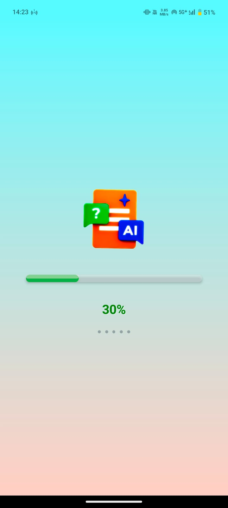
  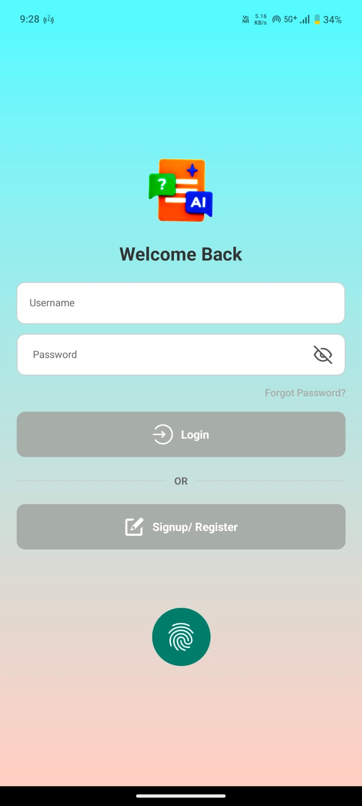
  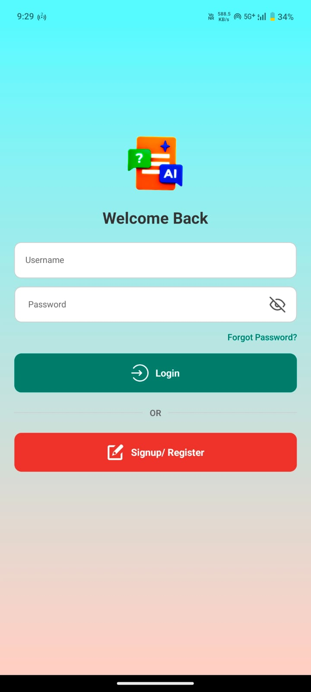
</p>

<p align="center">
  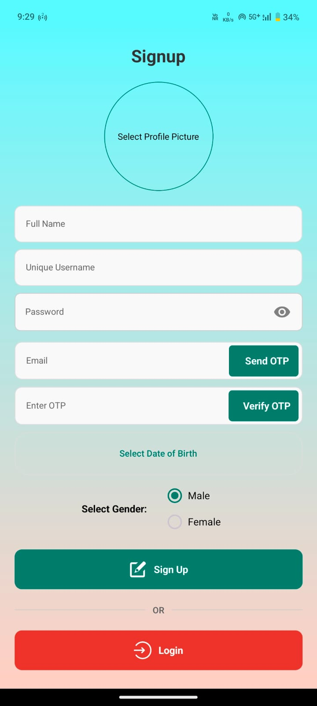
  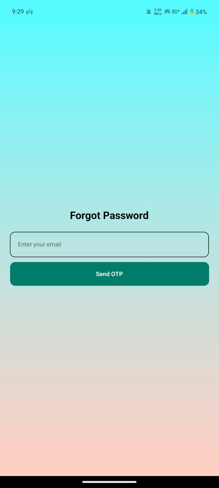
  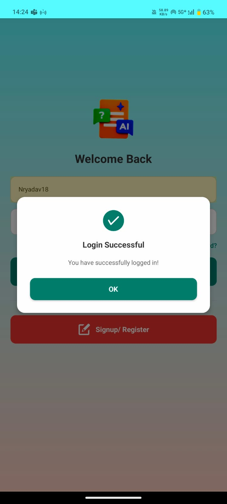
</p>

<p align="center">
  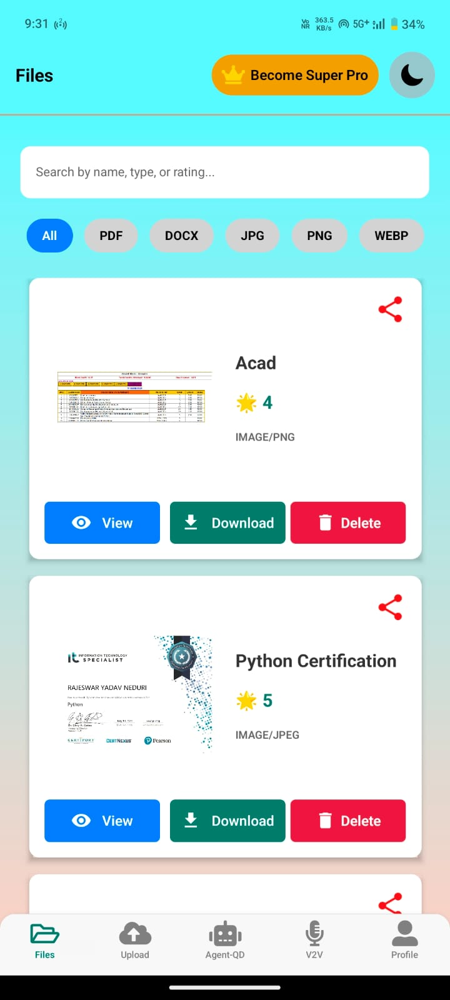
  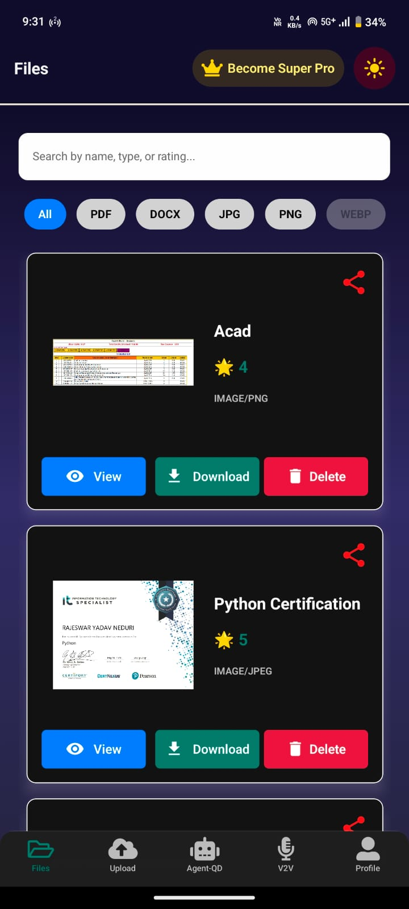
  
</p>

<p align="center">
  
  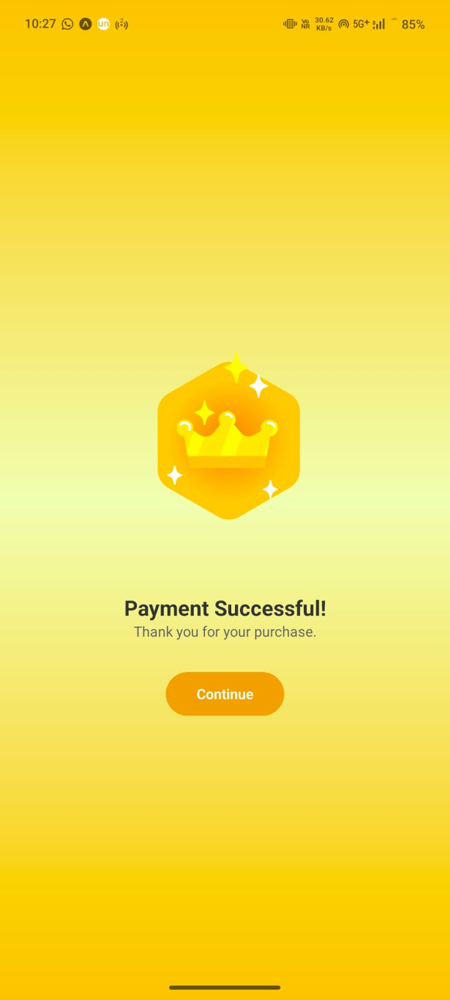
  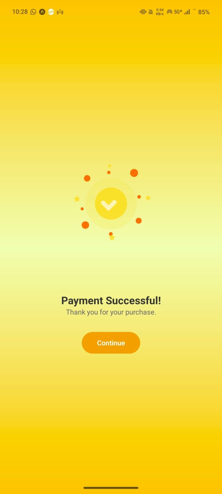
</p>

<p align="center">
  
  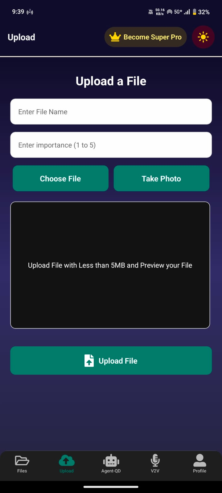
  
</p>

<p align="center">
  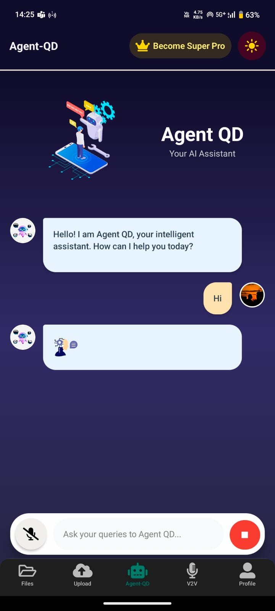
  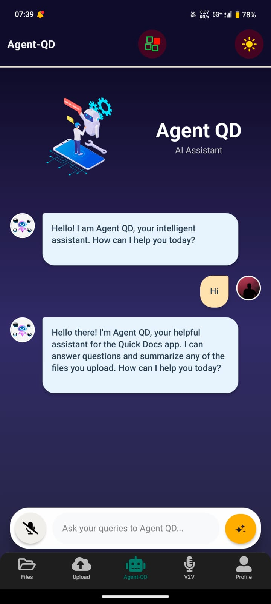
  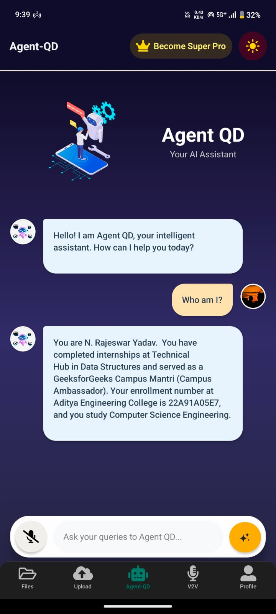
</p>

<p align="center">
  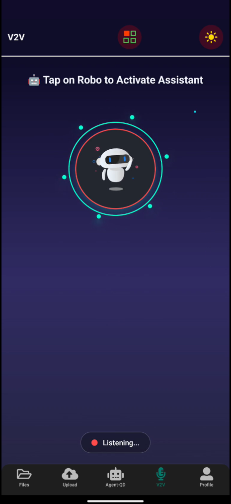
  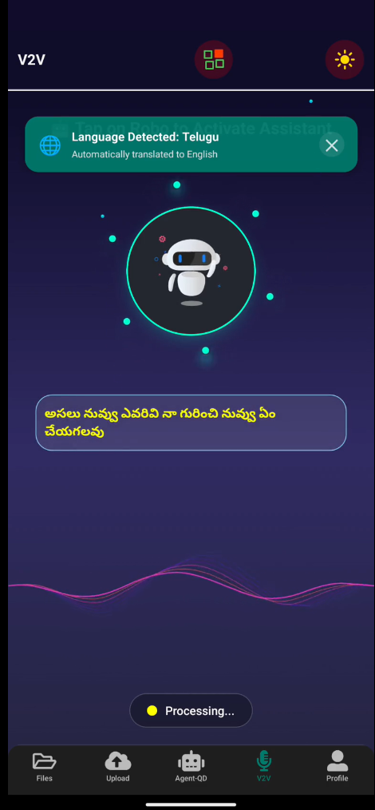
  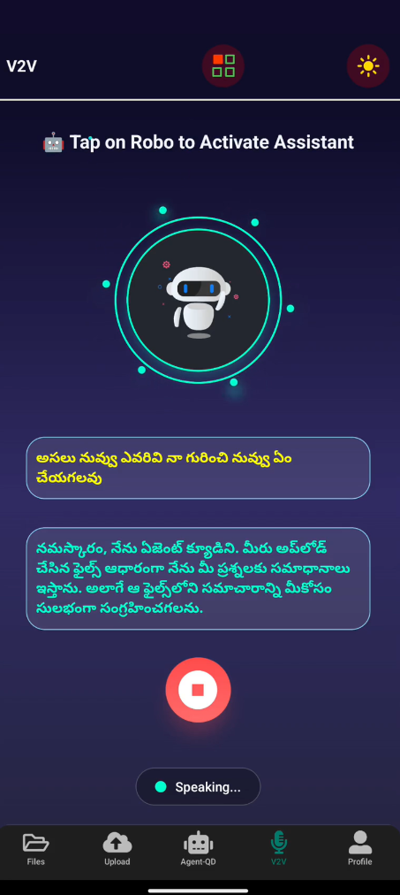
</p>

<p align="center">
  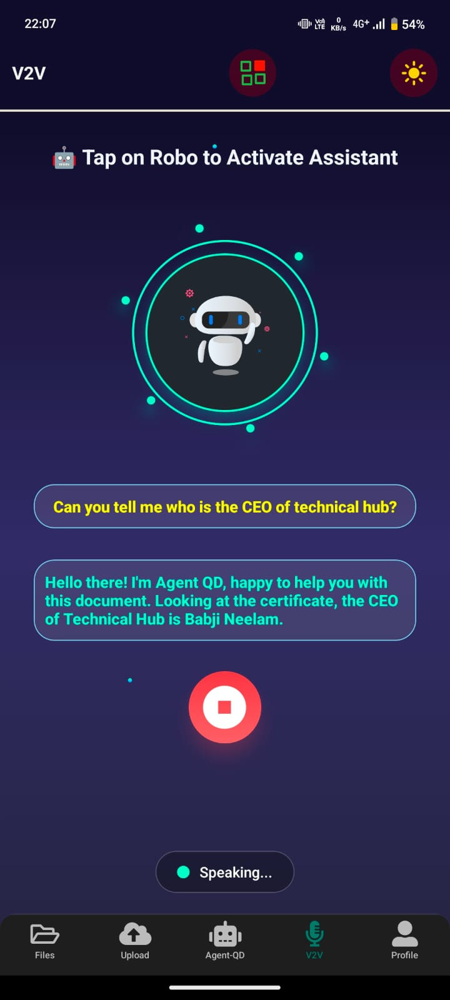
  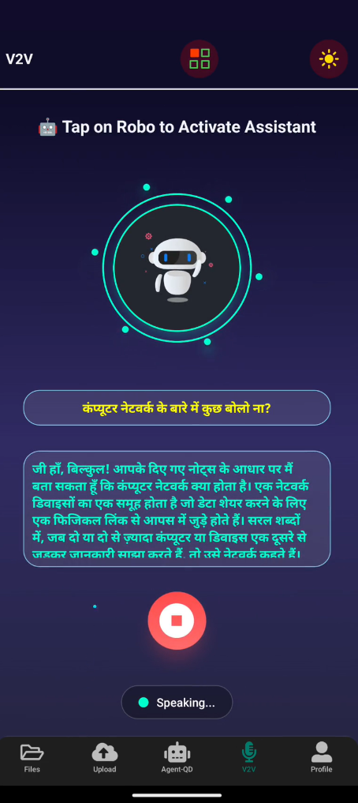
  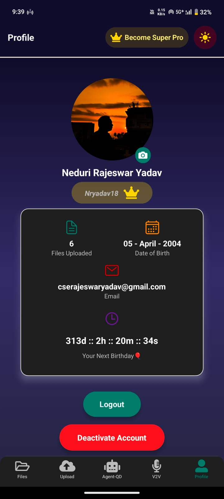
</p>

---

## 💡 Features

- 🧠 Gemini Pro (2.5) via Vertex AI — Chat with documents (PDF, DOCX)
- 🗣️ Voice Assistant — voice-to-voice AI using Cloud TTS & STT
- 📸 Google Vision AI — OCR, Face, Logo, Landmark, Content moderation
- 🌐 Google Translate — auto-detect language, translate content
- 🔐 AES encryption + JWT auth + Expo Secure Storage
- 🧾 RazorPay integration for monetization (free & premium tiers)
- 📊 AI Dashboard with document history & insights

---

## 🧰 Tech Stack

### 💻 Frontend (visible/)
- React Native Expo SDK 53
- Zustand (lightweight global state)
- Firebase Cloud Messaging (v1)
- Expo Secure Storage + Biometrics
- EAS Build system

---

## 📦 Packages Used

```bash
"axios"
"zustand"
"expo-secure-store"
"expo-local-authentication"
"react-native-voice"
"react-native-push-notification"
```

🔓 Monetization
🆓 Free Tier: Upload 1 doc + 3 AI queries

💎 Premium Access: Unlock full features with RazorPay

<p align="left">       </p>

### Clone the repo
```bash
git clone https://github.com/nryadav18/quick-docs.git
cd quick-docs
```

### Installation
```bash
cd visible
npm install
```

### Running the Frontend
```bash
npx expo start
```